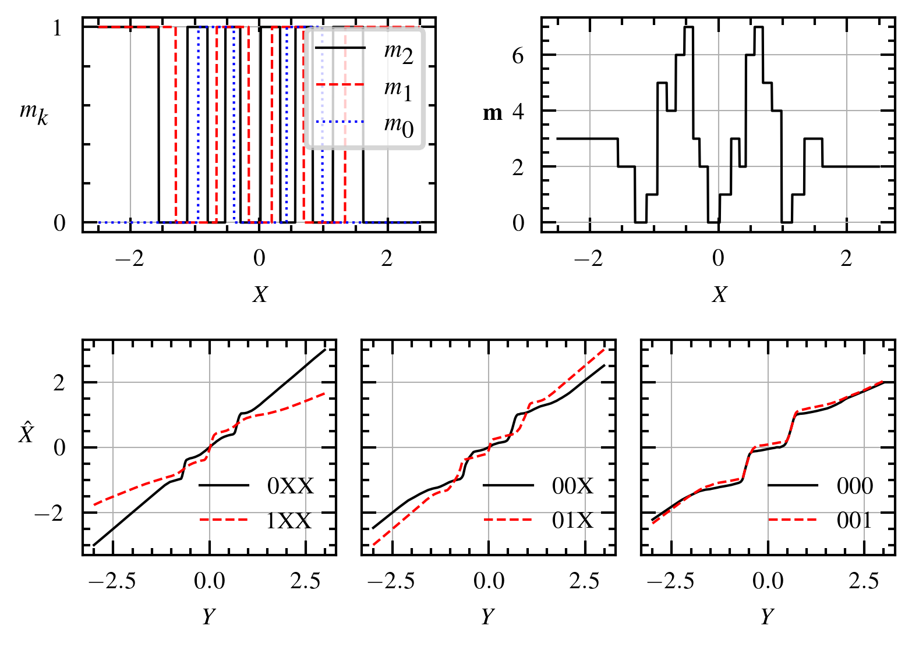

Implementation of our paper:

> B. Joukovsky, B. De Weerdt, and N. Deligiannis: "Learned Layered Coding for Successive Refinement in the Wyner-Ziv Problem", IEEE International Conference on Acoustics, Speech and Signal Processing (ICASSP), 2024.

Replicating the RNN results of the paper:

```shell
## Noise variance 0.1
### Marginal priors
python wyner_ziv/main_layered.py --planes 3 --code_size 2 --noise_power .1 --shared_encoder --shared_decoder --ld 6 --marginal
python wyner_ziv/main_layered.py --planes 2 --code_size 4 --noise_power .1 --shared_encoder --shared_decoder --ld 6 --marginal
### Conditional priors
python wyner_ziv/main_layered.py --planes 3 --code_size 2 --noise_power .1 --shared_encoder --shared_decoder --ld 160 --log_name results/cond_priorv3/noise.1/leaky222_shared_enc_shared_dec/lambda160
python wyner_ziv/main_layered.py --planes 2 --code_size 4 --noise_power .1 --shared_encoder --shared_decoder --ld 120
## Noise variance 0.01
### Marginal priors
python wyner_ziv/main_layered.py --planes 3 --code_size 2 --noise_power .01 --shared_encoder --shared_decoder --ld 80 --marginal
python wyner_ziv/main_layered.py --planes 2 --code_size 4 --noise_power .01 --shared_encoder --shared_decoder --ld 100 --marginal
### Conditional priors
python wyner_ziv/main_layered.py --planes 3 --code_size 2 --noise_power .01 --shared_encoder --shared_decoder --ld 120 --log_name results/cond_priorv3/noise.01/leaky222_shared_enc_shared_dec/lambda120
python wyner_ziv/main_layered.py --planes 2 --code_size 4 --noise_power .01 --shared_encoder --shared_decoder --ld 160
```

Illustration of the compressor of the 222 model on noise variance 0.01:



Commands for training the monolithic models (code size `<B>` being either 2, 4, 8, or 16):

```shell
## Noise variance 0.1
### Marginal priors
python wyner_ziv/main_monolithic.py --noise_power .1 --ld 6 --marginal --code_size <B>
### Conditional priors
python wyner_ziv/main_monolithic.py --noise_power .1 --ld 120 --code_size <B> --log_name results/cond_priorv3/noise.1/mono/code<B>_lambda120
## Noise variance 0.01
### Marginal priors
python wyner_ziv/main_monolithic.py --noise_power .01 --ld 80 --marginal --code_size <B>
### Conditional priors
python wyner_ziv/main_monolithic.py --noise_power .01 --ld 120 --code_size <B> --log_name results/cond_priorv3/noise.01/mono/code<B>_lambda120
```
